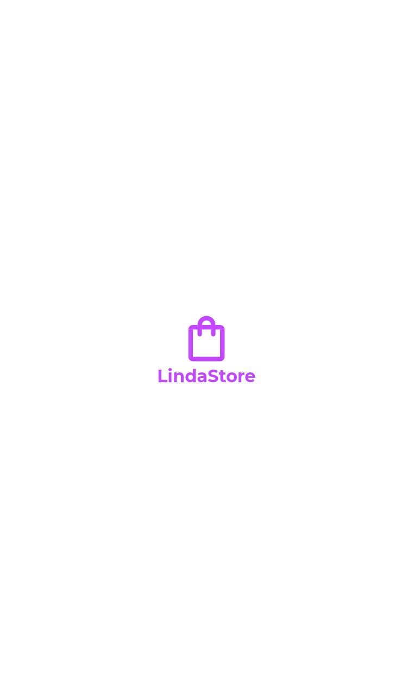
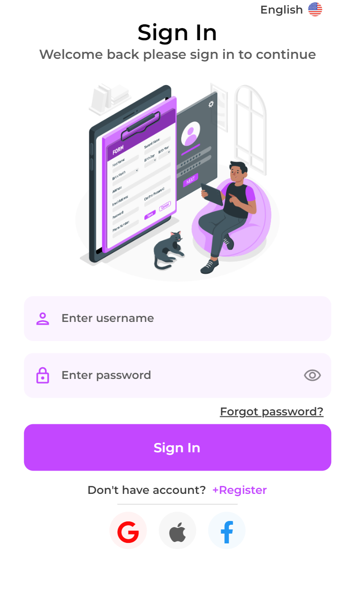
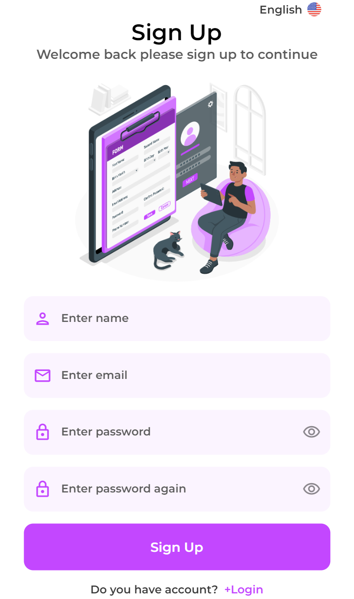
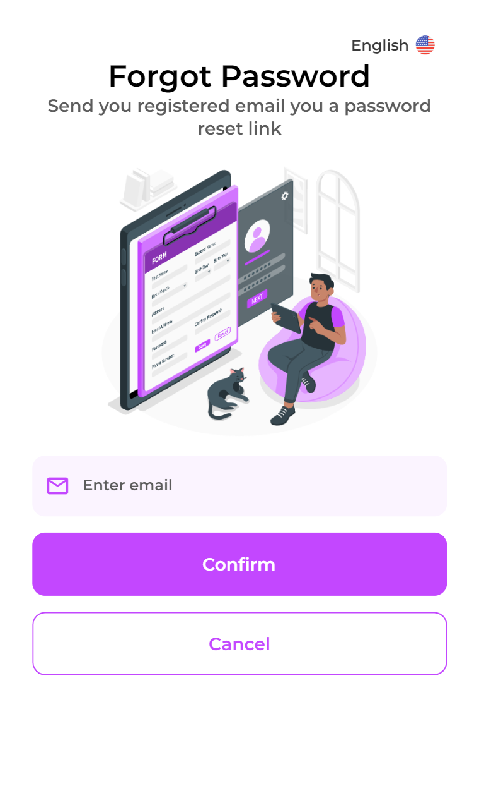
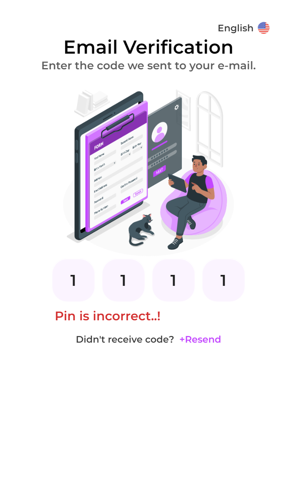
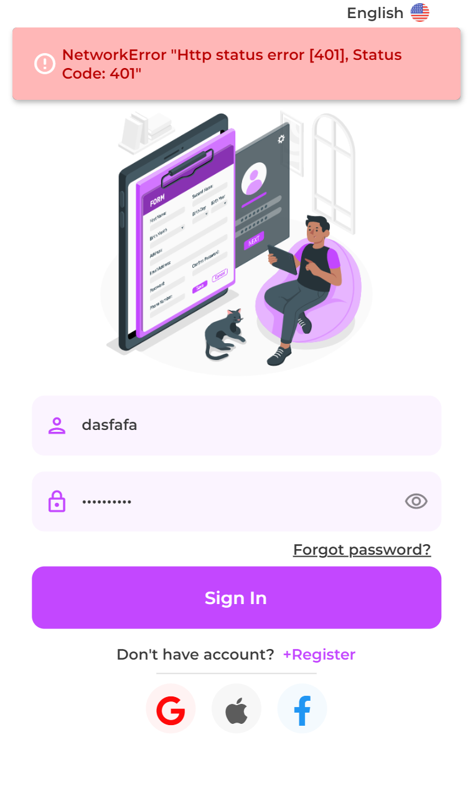
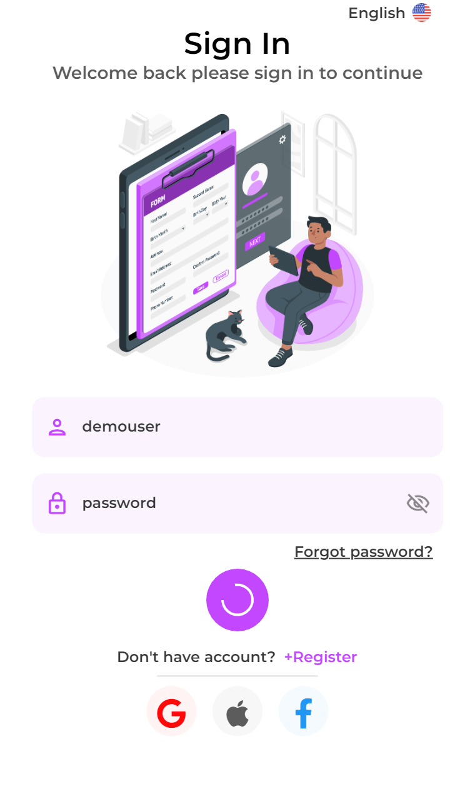

# Linda E-Store

A flutter ecommerce application that uses [Fake Store API](https://fakestoreapi.com/) as backend.

##  Screens

| Splash | Signin | Signup | Forgot | Verification | Login Error | Login Loading | 
|:-:|:-:|:-:|:-:|:-:|:-:|:-:|
| |  |  |  |  |  |  |

## Dependencies

- State Management & Design Pattern [BLOC](https://pub.dev/packages/flutter_bloc)
- Code Generator for Data-Classes/Unions/Cloning [Freezed](https://pub.dev/packages/freezed)
- Navigation with [AutoRoute](https://pub.dev/packages/auto_route)
- Network with [Dio](https://pub.dev/packages/dio)
- Cache Management with [Hive](https://pub.dev/packages/hive_flutter)
- Localization with [EasyLocalization](https://pub.dev/packages/easy_localization)
- Connectivity with [Connectivity Plus](https://pub.dev/packages/connectivity_plus)
- Animation with [Lottie](https://pub.dev/packages/lottie)
- Utils [Kartal](https://pub.dev/packages/kartal)
- See file for more... [pubspec](pubspec.yaml)

## Support And Feedback

For support and feedback, you can contact us via email. Thank you.
> Email: [oguz-kaba@hotmail.com](mailto:oguz-kaba@hotmail.com)

## License

[Apache](LICENSE)
Coded by [oguzkaba](https://github.com/oguzkaba)

